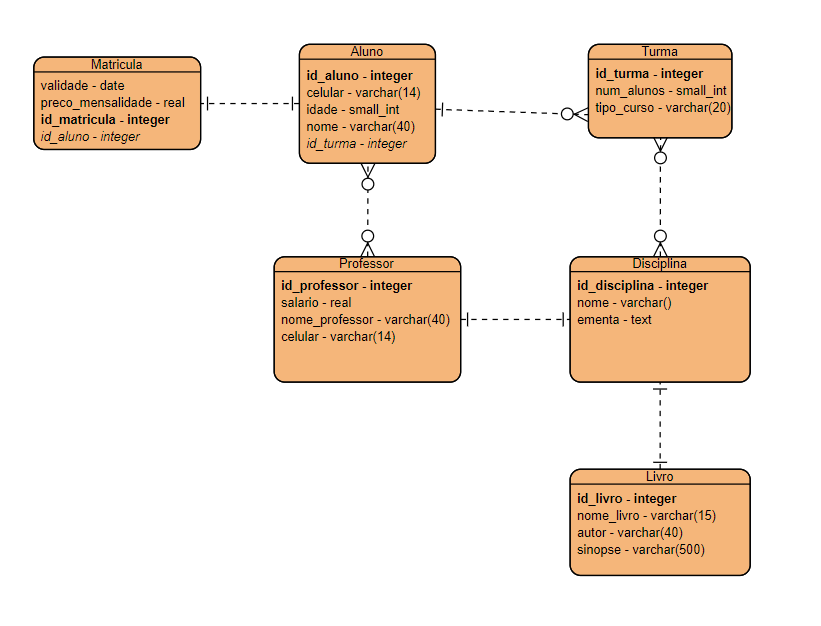

# Exercício de Banco de Dados - Escola

É a modelagem de um banco de dados de uma escola fictícia.

Seria um banco de dados relacional, que conteria informações de matrícula, aluno, professor, disciplinas, turmas e livros.

As informações de matrícula tem um relacionamento um para um com o aluno. 

O aluno se relaciona com a tabela de turma e professor. Sendo que um aluno tem somente uma turma, porém uma turma tem vários alunos, o que gera uma relação um para muitos. E o aluno tem vários professores e um professor tem vários alunos, gerando uma relação de muitos para muitos. 

A tabela de professor tem relação de um para um com a tabela de disciplina, portanto, nessa escola, um professor só dá aula de uma matéria. 

E a tabela de turma tem relação de muitos para muitos com a tabela de disciplina, visando que uma turma tem várias disciplinas e a mesma disciplina terá várias turmas.

Já a tabela livro, tem uma relação de um para um com a tabela de disciplina, o que, assim como a relação de professor e disciplina, pode ser diferente dependendo da escola. Como na escola fictícia criada, o relacionamento disciplina-livro é de um para um, então, é notável que cada disciplina terá somente um livro.

Em cada tabela, tem os atributos de cada item, assim como os atributos estrangeiros de acordo com suas relações. 

Porém, atributos extrangeiros de tabelas com relações muitos para muitos não estão em suas referentes tabelas pois, de acordo com a aula, será criado uma tabela separa para as relações.